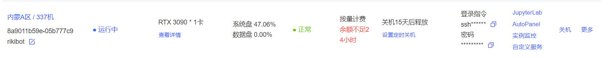

# 1 进入目录
进入到rikibot_project文件夹，在这里打开终端


将rikibot_ai_speech文件夹替换
# 2 启动小车低层控制
```
roslaunch rikibot bringup.launch 
```
# 3 启动语音控制
```
roslaunch rikibot rikibot_ai_speech rikibot_speech_ctrl.launch
```
# 4 更换服务器地址

在glm.py里将服务器地址更换为自己的，在autodl控制台点击自定义服务进入，然后复制上面的网址更换即可。服务器最好用3090的，避免显存不够的问题。


# 5 启动你的服务器
在ChatGLM目录  
```
python api.py
```


# 6 与小车对话
此时便可以与小车对话了

# 需要注意的：
## 1.最好开一个wifi热点，将电脑和小车都连这个热点，然后使用nomachine连接小车。第一次连接时，需要先将小车连接一个显示器，然后才能操作
## 2.记得打开小车的麦克风，若发出蓝光则是开着的，麦克风记得充电
## 3.记得根据自己的小车来更改device_id
device_id可以先运行下面这个来查看
```
roslaunch rikibot rikibot_ai_speech rikibot_speech_ctrl.launch
```

然后在，launch\rikibot_speech_ctrl.launch这个文件里更改成对应的device_id


# 模型地址
从 Hugging Face Hub 下载模型需要先安装Git LFS  

ChatGLM-6B
```
git clone https://huggingface.co/THUDM/chatglm-6b
```
中文Bert
```
git clone https://huggingface.co/sentence-transformers/distiluse-base-multilingual-cased-v1
```
(可能需要配置代理)

# 主要更改的代码
## glm.py
构建小车与服务器连接的函数
## rikibot_speech_ctrl.py
实现小车语音控制

